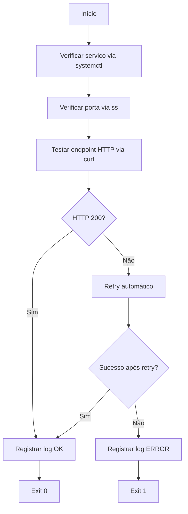

# Health Check Automation - Bash


## 🎯 Objetivo

Este projeto tem como objetivo aplicar, de forma prática e incremental, conceitos de automação operacional utilizando Bash.

O script realiza verificações automatizadas de disponibilidade de serviços e endpoints HTTP, simulando cenários reais de ambientes DevOps/SRE, com foco em confiabilidade, prevenção de falhas e boas práticas operacionais.

---

# 🚀 Versão Atual

## v2.0 – Verificações operacionais completas

Funcionalidades implementadas:

- Verificação de disponibilidade de serviço via `systemctl`
- Verificação de porta em escuta utilizando `ss`
- Verificação de endpoint HTTP utilizando `curl`
- Retry automático em falhas temporárias
- Geração de log estruturado contendo:
  - timestamp
  - serviço monitorado
  - status da verificação
  - porta analisada
  - código HTTP retornado
- Retorno de exit code apropriado:
  - `exit 0` → sucesso
  - `exit 1` → falha

Exemplo de log gerado:
```
[2026-03-15 20:10:42] [SERVICE:apache2] [STATUS:OK] [PORT:80] [HTTP:200]
```

---

## 🧠 Conceitos Aplicados

Este projeto aplica conceitos fundamentais utilizados em rotinas de automação DevOps/SRE:

- Shell Script (Bash)
- Controle de fluxo (`if`, `while`)
- Variáveis
- Exit codes
- Verificação de serviços Linux (`systemctl`)
- Verificação de portas (`ss`)
- Testes HTTP (`curl`)
- Retry logic
- Logging estruturado
- Troubleshooting em camadas (serviço → porta → HTTP)

---

# 🔍 Fluxo de Verificação

O script executa uma sequência de verificações para determinar a disponibilidade do serviço.


---

## ▶ Como Executar

Dar permissão de execução ao script:
```
chmod +x health_check.sh
```
Executar o script:
```
./health_check.sh
```
Verificar o log gerado:
```
cat health_check.log
```
---

## 📂 Estrutura do Projeto
```
health-check-automation-bash
│
├── health_check.sh
├── README.md
├── .gitignore
└── health_check.log (ignorado pelo Git)
```
**Descrição:**
- `health_check.sh` → Script principal
- `health_check.log` → Arquivo de log gerado em tempo de execução (ignorado pelo Git)
- `.gitignore` → Arquivos que não devem ser versionados

---

## 🔄 Evolução Planejada

Este projeto será evoluído incrementalmente conforme avanço nos estudos de DevOps/SRE.

Cada evolução adiciona novas capacidades de automação e observabilidade. Será versionada por tag, mantendo histórico claro das melhorias implementadas.

---

## 📌 Objetivo de Aprendizado

Simular, de forma progressiva, práticas próximas a ambientes reais de produção, reforçando:

- Mentalidade de confiabilidade
- Automação preventiva
- Estruturação de scripts para uso em pipelines
- Versionamento e evolução incremental
- Troubleshooting em múltiplas camadas (serviço → porta → aplicação)

---

## 🗺 Roadmap do Projeto

### ✔ v1.0
- Health check HTTP básico
- Logging com timestamp
- Exit codes apropriados

### ✔ v2.0 (atual)
- Verificação de serviço via `systemctl`
- Verificação de porta via `ss`
- Verificação HTTP via `curl`
- Retry automático
- Log estruturado

### 🔜 v3.0
- Log rotativo
- Integração com cron

### 🔜 v4.0
- Integração com CI/CD
- Estruturação para containerização (Docker)

### 🔜 Futuras Evoluções
- Notificação automática em caso de falha
- Integração com monitoramento
- Testes automatizados do script

---

# 📜 Changelog

## v2.0 (versão atual)
- Implementada verificação de serviço utilizando `systemctl`
- Implementada verificação de porta com `ss`
- Implementado retry automático para requisições HTTP
- Log estruturado com informações de serviço, porta e status HTTP

## v1.0
- Implementação inicial do health check HTTP
- Logging básico com timestamp
- Exit codes para sucesso e falha

---

## 👩‍💻 Autora

Helena Oliveira Silva  
DevOps | SRE | Automação
